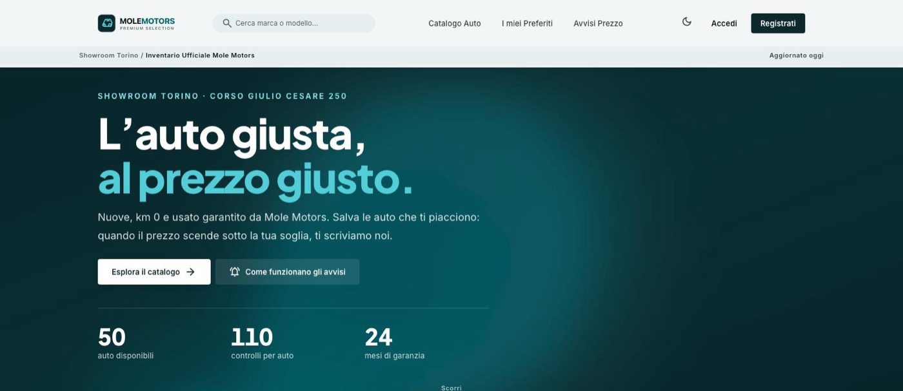
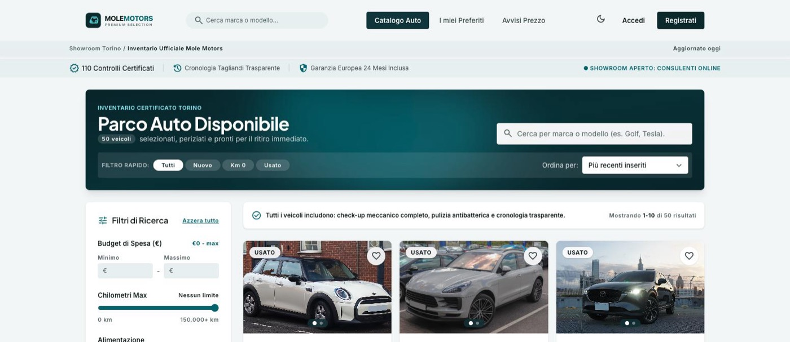
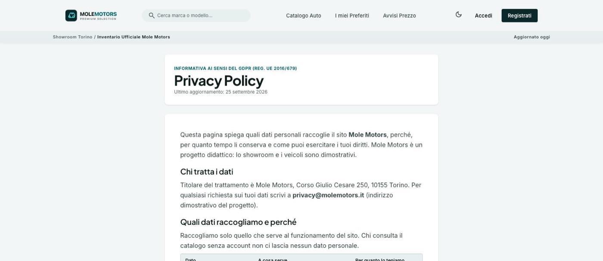
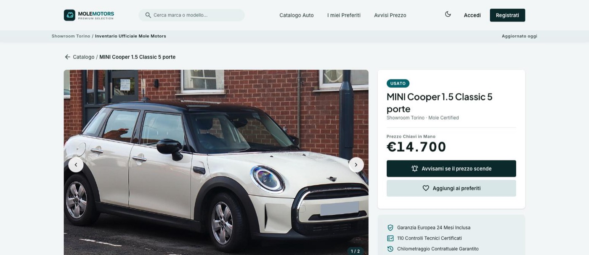
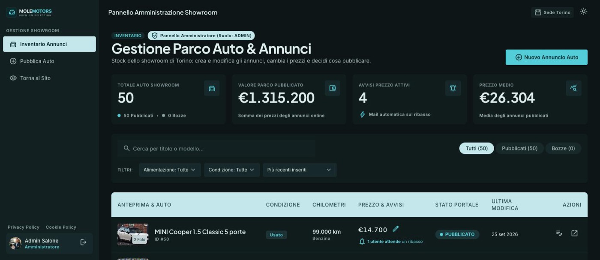
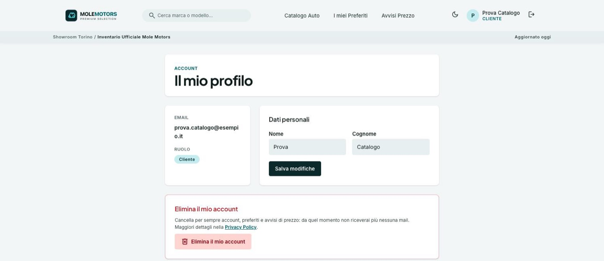
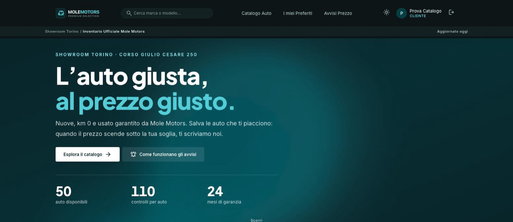

# Mole Motors · mini salone auto

Web app di un salone di automobili a Torino: catalogo pubblico con ricerca e ordinamento, preferiti e **avvisi di prezzo via email** per gli utenti registrati, pannello per l'amministratore che gestisce gli annunci.

**Stack:** React 19 + Vite + Tailwind 4 (frontend) · Spring Boot 4 + Java 25 + PostgreSQL (backend) · JWT · Gmail SMTP · deploy su Render.



---

## Indice

1. [Avvio rapido](#avvio-rapido)
2. [Accessi e schermate](#accessi-e-schermate)
3. [Cosa fa l'applicazione](#cosa-fa-lapplicazione)
4. [Sicurezza: come sono difesi i requisiti](#sicurezza-come-sono-difesi-i-requisiti)
5. [La mail di avviso prezzo](#la-mail-di-avviso-prezzo)
6. [Scelte e limiti noti](#scelte-e-limiti-noti)
7. [API](#api)
8. [Deploy su Render](#deploy-su-render)
9. [Test](#test)
10. [Struttura del progetto](#struttura-del-progetto)
11. [Crediti](#crediti)

---

## Avvio rapido

Servono **Java 25**, **Node 20+** e **PostgreSQL** in ascolto sulla 5432 (utente `postgres`, password `admin`).

```bash
# 1. crea il database (una volta sola)
createdb -U postgres salone_auto

# 2. avvia backend + frontend (libera da sola le porte 8080 e 5173)
cd Deploy-Base-JSX
./avvia.sh          # su Windows: avvia.cmd

# 3. apri il sito
open http://localhost:5173
```

Al primo avvio il backend crea le tabelle, carica **50 annunci di esempio** e i due account di prova qui sotto.

---

## Accessi e schermate

> ⚠️ Credenziali **solo per lo sviluppo locale**: le crea `avvia.sh`. Su Render questi account non esistono: l'admin si crea con le variabili `ADMIN_EMAIL` / `ADMIN_PASSWORD` scelte al momento del deploy.

| Chi | Come entra | Credenziali di prova | Cosa può fare |
|---|---|---|---|
| **Visitatore** | nessun accesso | — | sfogliare il catalogo, cercare, filtrare, ordinare, aprire le schede |
| **Utente** | [Accedi](http://localhost:5173/login) | `prova.catalogo@esempio.it` · `ProvaCatalogo1` | tutto il visitatore + preferiti, avvisi di prezzo, profilo, eliminare l'account |
| **Amministratore** | [Accedi](http://localhost:5173/login), poi **Area Admin** | `admin@molemotors.it` · `AdminMole2026` | tutto l'utente + creare, modificare, pubblicare annunci e cambiare i prezzi |

Ci si può anche registrare da [/registrazione](http://localhost:5173/registrazione): un nuovo account è sempre **utente**, mai admin.

### Le schermate

| Pagina | Indirizzo | Chi la vede |
|---|---|---|
| Home (presentazione, si scorre) | `/` | tutti |
| Catalogo | `/catalogo` | tutti |
| Scheda auto | `/auto/:id` | tutti |
| Accedi · Registrati | `/login` · `/registrazione` | tutti |
| Password dimenticata · Nuova password | `/password-dimenticata` · `/reimposta-password?token=…` | tutti (il secondo arriva dalla mail) |
| Disattiva avviso | `/avvisi/disattiva?token=…` | chi riceve la mail |
| I miei preferiti | `/preferiti` | utente, admin |
| Avvisi prezzo | `/avvisi` | utente, admin |
| Il mio profilo | `/profilo` | utente, admin |
| Gestione annunci | `/admin` | solo admin |
| Privacy Policy · Cookie Policy | `/privacy` · `/cookie` | tutti (link nel footer di ogni pagina) |

| | |
|---|---|
|  **Catalogo** – ricerca, filtri, ordinamento, 10 auto per pagina |  **Privacy Policy** – raggiungibile dal footer di ogni pagina |
|  **Scheda auto** – carousel, prezzo, preferiti e avviso |  **Pannello admin** – statistiche, tabella, prezzo rapido, pubblica/bozza |
|  **Profilo** – dati personali ed «Elimina il mio account» |  **Tema scuro** – pulsante ☀️/🌙 nell'header |

Il sito è **responsive** (mobile, tablet, desktop) e ha il **tema chiaro/scuro**: la scelta resta salvata, altrimenti segue il sistema operativo.

**Animazioni** (da [Animate UI](https://animate-ui.com), adattate):
- sfondo a bolle nell'apertura della Home e nell'intestazione del catalogo, che segue il mouse;
- cambio tema con un cerchio che si allarga dal pulsante ☀️/🌙;
- numeri che contano (auto disponibili, riquadri dell'admin) e prezzi le cui cifre scorrono quando cambiano;
- card e sezioni che entrano in dissolvenza; pillola che scivola nei filtri rapidi e nelle schede dell'admin.

Tutte le animazioni si fermano se il sistema ha «riduci movimento» attivo (`prefers-reduced-motion`), e il codice che le contiene si carica a parte per non rallentare la prima pagina.

---

## Cosa fa l'applicazione

**Home**
- Pagina di presentazione che si scorre: apertura a tutto schermo, contatore delle auto disponibili, ultimi arrivi, come funzionano gli avvisi, garanzie e invito al catalogo.

**Catalogo (anche senza account)**
- Ricerca per marca/modello, filtri per condizione (nuovo, km 0, usato), carburante, prezzo e chilometri.
- Ordinamento per data, prezzo, chilometraggio o nome; **10 annunci per pagina**.
- Filtri, ordine e pagina stanno nell'URL: un link al catalogo filtrato si può condividere.

**Utente registrato**
- Registrazione (nome, cognome, email, password) e login; «Password dimenticata?» manda un link valido **120 minuti**, usabile una volta sola.
- ❤️ Preferiti.
- 🔔 **Avviso di prezzo**: si sceglie una soglia; quando l'admin abbassa il prezzo sotto la soglia arriva **una** mail, con un link per disattivare l'avviso.
- Profilo modificabile ed **«Elimina il mio account»**, che cancella account, preferiti e avvisi.

**Amministratore**
- Crea e modifica annunci: foto (carousel, fino a 10), titolo, descrizione, chilometraggio, carburante, prezzo, stato (nuovo / km 0 / usato).
- Salva come **bozza** (invisibile al pubblico) o **pubblica**; non si pubblica un annuncio senza foto.
- Modifica rapida del prezzo dalla tabella, con il numero di utenti che attendono un ribasso.

---

## Sicurezza: come sono difesi i requisiti

**Dati in ingresso**

| Requisito | Come | Dove |
|---|---|---|
| Ricerca e ordinamento non concatenano niente | filtri con JPA Criteria (parametri legati; `%` e `_` scritti dall'utente trattati come testo); `sort` confrontato con un **elenco chiuso** (`recenti`, `prezzo`, `km`, `titolo`), altrimenti 400 | `AutoService.ORDINAMENTI`, `AutoSpecifications` |
| Descrizione e nome sono testo | nessun `dangerouslySetInnerHTML`; la descrizione si mostra con `whitespace-pre-line`. Le mail usano Thymeleaf con **solo `th:text`/`th:href`**, che fanno l'escape | `DettaglioAuto.jsx`, `templates/mail/*.html` |
| Registrazione, profilo, avvisi ricevono un DTO | `record` con i soli campi ammessi: `ruolo`, `inviato`, `utenteId` aggiunti al JSON **non cambiano niente** | `dto/*`, test `registrazioneIgnoraRuoloEIdNelCorpo`, `avvisoIgnoraUtenteIdEInviatoNelCorpo` |

**Chi può fare che cosa**

| Requisito | Come | Dove |
|---|---|---|
| Solo l'admin cambia i prezzi | `/api/admin/**` richiede `ROLE_ADMIN` (+ `@PreAuthorize`): un utente riceve **403** | `SecurityConfig`, `AdminAutoController` |
| Il ruolo lo decide il server | la registrazione crea sempre `USER`; l'admin nasce solo da variabili d'ambiente | `AuthService.registra`, `AdminSeeder` |
| Il JWT contiene solo il necessario | `sub` (id), `ruolo`, `iat`, `exp`. Niente email né nome | `JwtService` |
| `/api/avvisi/12` → `/api/avvisi/13` dà 404 | avvisi e preferiti si cercano **per id e proprietario insieme** | `findByIdAndUtenteId`, test `preferitiEAvvisiAltruiRispondono404` |
| Link della mail con token casuale monouso | 32 byte casuali, nel DB solo lo SHA-256; dopo l'uso si cancella | `TokenCasuale`, `AvvisoService.disattivaConToken` |
| Niente password né email nei log | si logga solo l'id dell'utente; gli errori di invio mail riportano solo il tipo di eccezione | `MailService`, `GestoreErrori` |
| La password di Gmail non entra nella repo | `MAIL_PASSWORD` solo da variabile d'ambiente, **senza valore di ripiego** | `application.yml` |

**Protezioni aggiuntive**
- **Limite di tentativi (429)**: 5 password sbagliate per email in 15 minuti, 3 mail di reset per indirizzo all'ora, limiti per IP su login, reset e registrazione.
- **Cambio password = sessioni chiuse**: i JWT emessi prima non valgono più.
- **Chiave JWT**: in produzione il backend non parte se `JWT_SECRET` manca.
- **Content-Security-Policy** sul sito pubblicato: accetta solo i nostri script.

---

## La mail di avviso prezzo

```
Admin cambia il prezzo ──► salvataggio (commit) ──► evento PrezzoCambiato
                                                        │  @TransactionalEventListener(AFTER_COMMIT) + @Async
                                                        ▼
                         UPDATE avvisi SET inviato = true, token_hash = ?
                         WHERE id = ? AND inviato = false AND attivo = true
                                                        │  1 riga aggiornata? ──no──► nessuna mail
                                                        ▼ sì (e dopo il commit)
                                                 invio con Gmail
```

- **Dopo il salvataggio**: la mail la manda chi ascolta l'evento **dopo il commit** (`AFTER_COMMIT`) in un altro thread (`@Async`). Se il salvataggio fallisce non parte niente, e l'amministratore non aspetta Gmail.
- **Mai due volte**: il segno `inviato` si prende con un solo `UPDATE … WHERE inviato = false`; la mail parte solo se la riga aggiornata è **una**. Due ribassi ravvicinati non producono due mail (test `dueControlliContemporaneiMandanoUnaSolaMail`).
- **Se Gmail non risponde**: l'avviso **resta segnato come inviato** e quella mail è persa. *Perché*: preferiamo perdere una notifica piuttosto che mandarne due (un doppione sembra spam e fa perdere fiducia). L'errore finisce nel log (senza indirizzo) e l'utente vede comunque il prezzo aggiornato nel sito; se il prezzo risale sopra la soglia l'avviso si «ricarica» e potrà scattare di nuovo.
- In locale, senza Gmail configurato, la mail non parte e il **link** compare nel log del backend (`APP_MAIL_LOG_LINK=true`), così si può provare tutto il flusso.

---

## Scelte e limiti noti

| Tema | Scelta | Perché / limite |
|---|---|---|
| Token nel browser | JWT in `localStorage` + CSP | semplice e senza CSRF; la CSP riduce il rischio XSS. Alternativa più robusta: cookie `HttpOnly` |
| Limite tentativi | in memoria | sufficiente con una sola istanza (piano free di Render); con più istanze servirebbe Redis |
| Registrazione con email già usata | risponde 409 | rivela che l'email esiste; mitigato dal limite di 10 registrazioni/ora per IP. Soluzione completa: verifica email alla registrazione |
| Foto degli annunci | URL `https` inseriti dall'admin | niente upload da gestire; le foto demo sono da Wikimedia Commons (licenze CC) |
| Annunci demo | caricati se la tabella è vuota | in produzione spenti (`APP_SEED_AUTO=false`); per una demo online impostare `true` |
| Admin | uno solo, da variabili d'ambiente | nessun endpoint crea amministratori; l'admin non può eliminarsi dal profilo |

---

## API

Tutte sotto `/api`. Il token va nell'header `Authorization: Bearer <token>`.

| Metodo | Percorso | Chi |
|---|---|---|
| POST | `/auth/registrazione` · `/auth/login` · `/auth/password-dimenticata` · `/auth/reimposta-password` | tutti |
| GET | `/auto?q&carburante&condizione&prezzoMin&prezzoMax&kmMin&kmMax&sort&dir&page&size` · `/auto/{id}` | tutti |
| POST | `/avvisi/disattiva` (token dalla mail) | tutti |
| GET · PUT · DELETE | `/me` | utente |
| GET · POST · DELETE | `/preferiti` · `/preferiti/{id}` | utente |
| GET · POST · PUT · DELETE | `/avvisi` · `/avvisi/{id}` | utente |
| GET | `/admin/auto` · `/admin/auto/{id}` · `/admin/auto/statistiche` | admin |
| POST · PUT | `/admin/auto` · `/admin/auto/{id}` | admin |
| PATCH | `/admin/auto/{id}/prezzo` | admin |
| POST | `/admin/auto/{id}/pubblica` · `/admin/auto/{id}/bozza` | admin |

Errori sempre nello stesso formato: `{ "stato": 400, "messaggio": "Dati non validi", "dettagli": ["prezzo: …"] }`.

---

## Deploy su Render

Stesso percorso dei giorni scorsi: `render.yaml` (Blueprint), `be/Dockerfile`, `DatabaseUrl.java`.

1. **New › Blueprint** e scegli la repo: nascono database, backend e frontend.
2. Imposta le variabili (`sync: false`, senza `/` finale negli indirizzi):

| Servizio | Variabile | Valore |
|---|---|---|
| backend | `ALLOWED_ORIGIN` | indirizzo **esatto** del frontend, es. `https://app-fe.onrender.com` |
| backend | `FE_URL` | lo stesso indirizzo (serve ai link nelle mail) |
| backend | `JWT_SECRET` | generata da Render (≥ 32 caratteri) |
| backend | `ADMIN_EMAIL` · `ADMIN_PASSWORD` | credenziali dell'amministratore |
| backend | `MAIL_USERNAME` · `MAIL_PASSWORD` | account Gmail e **password per le app** (mai in `application.yml`) |
| backend | `APP_SEED_AUTO` | `false` (o `true` per una demo con i 50 annunci) |
| frontend | `VITE_API_URL` | indirizzo del backend, es. `https://app-be.onrender.com` |

3. **Manual Deploy** di entrambi (`VITE_API_URL` si legge in fase di build).

`/actuator/health` resta pubblico (health check di Render) e ogni chiamata del frontend passa da `fe/src/lib/api.js`.

---

## Test

```bash
cd Deploy-Base-JSX/be && sh ./mvnw test      # 24 test (H2 in memoria)
cd Deploy-Base-JSX/fe && npm run build
```

I test passano da HTTP come il browser e coprono i requisiti di sicurezza: ruolo ignorato nel corpo, 403 sul prezzo, 404 sulle risorse altrui, ordinamento non ammesso, token monouso, escape nelle mail, una sola mail con due controlli contemporanei, limiti 429, sessioni chiuse dopo il reset, eliminazione dell'account.

---

## Struttura del progetto

```
Deploy-Base-JSX/            ← il progetto (BE/ e FEJSX/ nella radice sono scheletri iniziali non usati)
  avvia.sh · avvia.cmd      avvio locale con credenziali di prova
  render.yaml               database + backend + frontend su Render
  be/                       Spring Boot
    src/main/java/it/epicode/base/
      model/  repository/  dto/  service/  web/  security/  mail/  errore/  config/
    src/main/resources/
      application.yml
      seed/auto.json        50 annunci di esempio (foto Wikimedia con crediti)
      templates/mail/       mail HTML (Thymeleaf)
  fe/                       React
    src/pages/              home, catalogo, scheda, auth, preferiti, avvisi, profilo, admin, privacy, cookie
    src/components/animate-ui/  componenti Animate UI adattati (bolle, numeri, dissolvenze)
    src/components/         header, footer, card, carousel, modali, pannello admin
    src/lib/api.js          unico punto delle chiamate al backend
    src/index.css           token colore (palette Petrolio, tema chiaro/scuro)
docs/schermate/             immagini di questo README
```

---

## Crediti

- Design di partenza generato con **Google Stitch** e adattato (palette «Petrolio», tema scuro).
- Foto dei veicoli da **Wikimedia Commons** con licenze Creative Commons: autore e licenza di ogni foto sono nel campo `crediti` di `seed/auto.json`.
- Animazioni da **[Animate UI](https://animate-ui.com)** (© 2025 Elliot Sutton, licenza MIT + Commons Clause): Bubble Background, Counting Number, Sliding Number, Fade e la tecnica di Theme Toggler e Tabs, adattati in JSX con i colori Petrolio.
- Font **Inter** e **Plus Jakarta Sans**, icone **Material Symbols** (Google Fonts).
- Progetto didattico: showroom, indirizzo e contatti sono dimostrativi.
